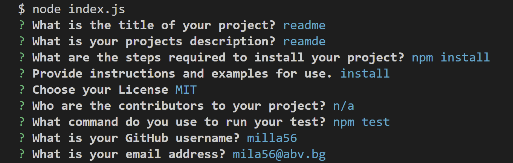
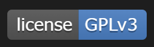
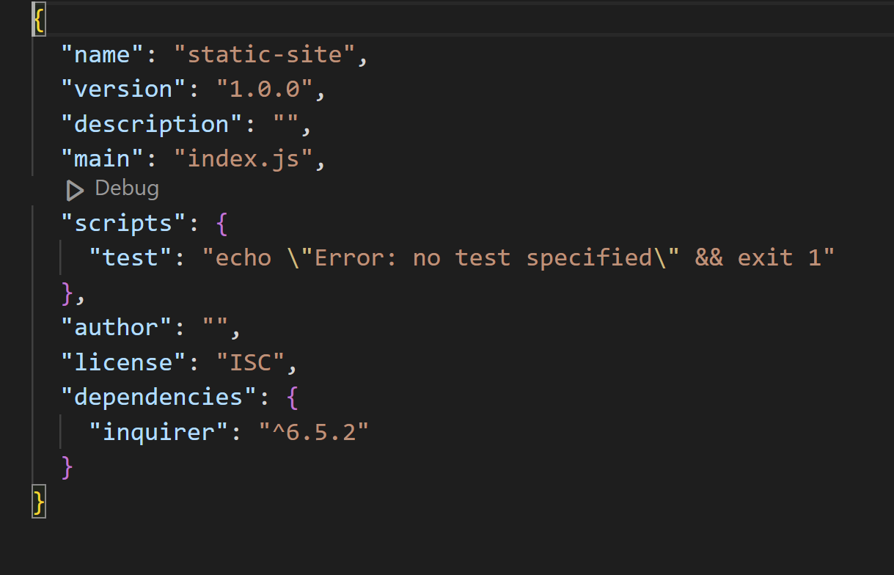

# README Generator

 ## Table Of Contents
  - [Description](#description)
  - [Video-Submission](#video-submission)
  - [Installation](#installation)
  - [User-Story](#user-story)
  - [Usage](#usage)
  - [Demo](#demo)
  - [Technologies-Used](#technologies-used)
  - [Credits](#credits)
  - [License](#license)

## Description

"Lubomila's Readme Generator" is a command-line application , which generates a professional README.md file from a user's input 
using the Inquirer package. The aim of this project is to help developers to devote more time to work on their projects and
quickly to generate Readme file.

## Video Submission
Follow the link for the video submission [Video](https://drive.google.com/file/d/111jO54jpuRmbQlw7DTobZX7uxLsc2Vxu/view) 

## Installation

- Clone the GitHub repository to your computer.
- Navigate to your terminal and use the following command "node index.js".
 

## User Story 
- AS A developer
- I WANT a README generator
- SO THAT I can quickly create a professional README for a new project

## Usage
The list shows what steps were made to complete the challenge:
- The application will be invoked by using the following command - "node index.js" - in the terminal.
- Readme file will be generated, when the user answer the questions , related to these sections:
  * Project Title
  * Project Description
  * "Table of Contents" is displayed
  * Project Installation 
  * Project Usage
  * Project License
  * Contributors 
  * Test
  * Questions
  
- When the user types the project title, the title will be displayed in the Readme file.
- When the user types the information about Description, Installation, Usage, Test and Contributors , the typed information
will be added to the sections of the Readme file.
- When the user chooses a License, the badge will be added at the top of the Readme file and under "License" section. To make the
license badges appear , I follow a "Markdown License Badge" guide.  
- When the user chooses the License, the badge will be presented in grey and blue colors.

 
 
 

- When the user types the email and GitHub account, this information will be added to the "Questions" section and like this
the user can contact the developer, regarding additional questions.
- When the user clicks on the sections in the Table of Contents, they are taken to the corresponding section of the README.
- When the user answer the questions, the Readme file will be saved in a folder, called "generateReadme".
- The ".gitignore" file includes "node_modules/" and ".DS_Store/".
- The repository includes a "package.json" with the required dependencies.

## Demo

## Technologies Used
- JavaScript
- Node JS
- ES6 
- Inquirer package - version 6.5.2
- Shields IO - Readme License Guide

## Credits

N/A

## License

milla56/Lubomila-s-README-Generator is licensed under the
MIT License
A short and simple permissive license with conditions only requiring preservation of copyright and license notices. Licensed works, modifications, and larger works may be distributed under different terms and without source code.

